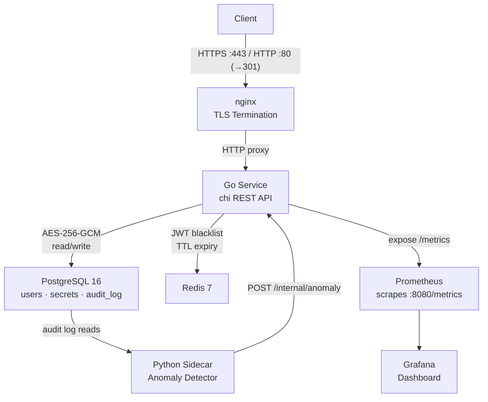

# VaultNet

A self-hosted secrets and credential lifecycle management platform built with Go, Python, PostgreSQL, Redis, Prometheus, and Grafana.

## Stack

| Component | Technology |
|---|---|
| Core API | Go 1.26+, chi router |
| Encryption | AES-256-GCM |
| Authentication | JWT (HS256) + Redis token blacklist |
| Database | PostgreSQL 16 |
| TTL Store | Redis 7 |
| Audit Analyser | Python 3.12 |
| Metrics | Prometheus + Grafana |
| Container Runtime | Docker + Docker Compose |

## Architecture


## API Endpoints

| Method | Route | Auth | Description |
|---|---|---|---|
| POST | /auth/register | No | Register a new user |
| POST | /auth/login | No | Login, receive JWT |
| POST | /secrets | Yes | Store an encrypted secret |
| GET | /secrets | Yes | List all active secrets (metadata only) |
| GET | /secrets/{name} | Yes | Retrieve and decrypt a secret |
| PUT | /secrets/{name}/rotate | Yes | Rotate secret value, increment version |
| DELETE | /secrets/{name} | Yes | Soft-delete a secret |
| GET | /health | No | Health check |
| GET | /metrics | No | Prometheus metrics |

## Quick Start

### Prerequisites
- Docker Desktop
- Go 1.26+
- Python 3.12+

### Run
```bash
git clone https://github.com/isshaan-dhar/VaultNet
cd VaultNet
cp .env.example .env
docker compose up --build -d
```

### Local Development (Go service outside Docker)

Update `.env`:
```
POSTGRES_HOST=localhost
REDIS_HOST=localhost
```

Then:
```bash
cd go-service
go run main.go
```

### Local Development (Python sidecar outside Docker)
```bash
cd python-sidecar
python -m venv venv
venv\Scripts\activate
pip install -r requirements.txt
python analyser.py
```

## Anomaly Detection

The Python sidecar analyses the audit log every 60 seconds and flags:

| Anomaly | Trigger | Severity |
|---|---|---|
| Brute Force | 5+ failed logins within 300s | CRITICAL |
| Rapid Secret Access | 10+ retrievals within 300s | HIGH |
| Off-Hours Access | Operations between 22:00–06:00 UTC | MEDIUM |
| Multiple Source IPs | 3+ distinct IPs within 300s | MEDIUM |

## Observability

| Service | URL |
|---|---|
| Grafana Dashboard | http://localhost:3000 (admin/admin) |
| Prometheus | http://localhost:9090 |
| API Health (via nginx) | https://localhost/health |
| API Metrics (via nginx) | https://localhost/metrics |

## Security Properties

- Secrets encrypted with AES-256-GCM before writing to database
- Unique nonce generated per encryption operation
- Passwords hashed with bcrypt (cost 10)
- JWT tokens expire after 24 hours
- Redis tracks TTL-based secret expiry
- Soft-delete preserves audit history
- Every operation written to append-only audit log
- Python sidecar detects and records anomalous access patterns
